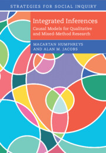

*Integrated Inferences* provides an introduction to fundamental principles of causal inference and Bayesian updating and shows how these tools can be used to implement and justify inferences using within-case (process tracing) evidence, correlational patterns across many cases, or a mix of the two. 

You can buy the  book at [Cambridge University Press](https://www.cambridge.org/core/books/integrated-inferences/45B07964AD4718A74CDE3E35A31F26FA), read the  [open access preprint](https://macartan.github.io/integrated_inferences/), explore the `R` package [`CausalQueries`](https://integrated-inferences.github.io/CausalQueries/), and read a 
[guide](https://macartan.github.io/assets/pdf/papers/2024_CausalQueries.pdf) to forming, updating, and querying causal models with  `CausalQueries` (Tietz et al 2024)


::: {.cell}

:::

```{mermaid}
%%{init: {"flowchart": {"htmlLabels": false}} }%%
flowchart LR
        A(The book at Cambridge) === B
        B(Open access preprint) === C
        C("CausalQueries") === D
        D("Guide to CausalQueries")
        click A "https://www.cambridge.org/core/books/integrated-inferences/45B07964AD4718A74CDE3E35A31F26FA"
        click B "https://macartan.github.io/integrated_inferences/"
        click C "https://integrated-inferences.github.io/CausalQueries/"
        click D "https://macartan.github.io/assets/pdf/papers/2024_CausalQueries.pdf"
        
```


<br><br>


::: {.cell layout-align="left"}
::: {.cell-output-display}
{fig-align='left' width=20%}
:::
:::

