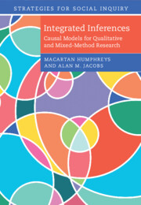

```{r setup, include=FALSE}
knitr::opts_chunk$set(echo = TRUE)
```

```{css, echo = FALSE}
.button2 {background-color: #008CBA;} /* Blue */
```

# Integrated Inferences: Causal Models for Qualitative and Mixed-Method Research

Key resources:

* [The book @ Cambridge](assets/cover_small.jpg)
* [Open access preprint](https://macartan.github.io/integrated_inferences/)
* The `R` package: [`CausalQueries`](https://macartan.github.io/CausalQueries/)
* Our [Guide to `Causal Queries`](https://integrated-inferences.github.io/guide/)
* Data


[](https://www.cambridge.org/core/books/integrated-inferences/45B07964AD4718A74CDE3E35A31F26FA)
